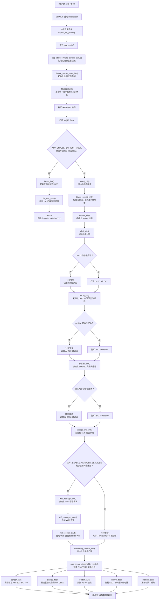

# ESP32 IoT Gateway 学习路线

本文档用于指导已经学习过 STM32 与 FreeRTOS 的同学，按当前项目代码逐步掌握 ESP32 + ESP-IDF 物联网网关项目，并最终整理为简历项目。

## 1. 学习目标

本项目的学习重点不是重新学习 C 语言或 FreeRTOS 基础，而是把已有的 STM32/FreeRTOS 经验迁移到 ESP32 工程中。

最终需要达到：

- 能独立完成 ESP32 工程编译、烧录、串口监视。
- 能看懂项目从 `app_main()` 到各组件初始化的启动流程。
- 能解释 FreeRTOS 多任务如何组织传感器采集、按键扫描、执行器控制、网络通信和状态维护。
- 能调试 GPIO、I2C、WiFi、Web API、MQTT、NVS、OTA。
- 能把该项目写进简历，并在面试中讲清楚架构、难点和调试过程。

## 2. 函数阅读路线

### 阶段一：主流程入口

先从 `main/app_main.c` 的 `app_main()` 开始。

重点阅读顺序：

```c
app_main()
board_init()
device_control_init()
button_init()
aht20_init()
bh1750_init()
storage_nvs_init()
wifi_manager_start()
web_server_start()
watchdog_service_init()
app_create_placeholder_tasks()
```

需要掌握：

- `app_main()` 是 ESP-IDF 应用入口，作用类似 STM32 工程中的 `main()`。
- `app_main()` 只负责初始化模块和创建任务，不承载复杂业务逻辑。
- 真正的周期性业务由 FreeRTOS 任务完成。
- `APP_ENABLE_I2C_TEST_MODE` 和 `APP_ENABLE_NETWORK_SERVICES` 这类配置决定启动模式。

掌握标准：

- 能画出系统启动流程图。
- 能说明每个初始化函数失败后对系统有什么影响。
- 能通过串口日志判断系统启动到了哪一步。
- **深度理解**：能解释为什么在 `app_main` 中需要先后调用 `app_status_init()` 和 `device_status_store_init()`（前者初始化入口日志用的局部状态，后者初始化全项目通用的“数据总线”静态全局状态，体现了组件化解耦思想）。


### 阶段二：FreeRTOS 任务组织

重点阅读 `main/app_tasks.c`。

按以下顺序阅读：

```c
app_status_init()
sensor_task()
display_task()
button_task()
control_task()
monitor_task()
app_create_placeholder_tasks()
```

需要掌握：

- `sensor_task()` 周期读取 AHT20 和 BH1750。
- `button_task()` 扫描 K1-K4 按键。
- `control_task()` 根据状态驱动 LED、蜂鸣器、继电器。
- `display_task()` 输出状态日志，后续对接 OLED 显示。
- `monitor_task()` 维护运行时间并喂狗。
- `app_create_placeholder_tasks()` 统一创建所有 FreeRTOS 任务。

和 STM32/FreeRTOS 的对应关系：

| 当前项目 | STM32/FreeRTOS 类比 |
| --- | --- |
| `xTaskCreate()` | 创建任务 |
| `vTaskDelay()` | 周期延时 |
| `sensor_task()` | 传感器采集任务 |
| `button_task()` | 按键扫描任务 |
| `watchdog_service_feed()` | 任务看门狗喂狗 |

掌握标准：

- 能解释每个任务的职责。
- 能说明为什么不把所有逻辑写在一个 `while(1)` 中。
- 能根据日志判断哪个任务正在运行或异常。

### 阶段三：板级引脚、GPIO、按键和执行器

重点阅读：

```text
components/board
components/button
components/device_control
```

重点函数：

```c
board_init()
button_init()
button_is_key_pressed()
device_control_init()
device_led_set()
device_buzzer_set()
device_relay_set()
```

需要掌握：

- `board.h` 统一管理 GPIO，避免引脚散落在业务代码中。
- 按键使用输入上拉，按下后通常读取低电平。
- LED、蜂鸣器、继电器使用 GPIO 输出控制。
- 继电器和蜂鸣器模块可能存在高电平触发或低电平触发差异，需要结合实机验证。

掌握标准：

- 能说明 K1/K2/K3/K4 分别对应哪个 GPIO。
- 能说明 LED、蜂鸣器、继电器分别由哪个 GPIO 控制。
- 能排查按键无响应、LED 不亮、继电器不吸合等问题。

### 阶段四：I2C 与传感器

重点阅读：

```text
components/sensor_aht20
components/sensor_bh1750
components/i2c_test
```

重点函数：

```c
aht20_init()
aht20_read()
bh1750_init()
bh1750_read()
i2c_test_start()
```

当前接线约定：

| 设备 | 地址 | SDA | SCL |
| --- | --- | --- | --- |
| AHT20 | `0x38` | `GPIO21` | `GPIO22` |
| BH1750 | `0x23` | `GPIO21` | `GPIO22` |

需要掌握：

- 多个 I2C 设备可以共用 SDA/SCL。
- I2C 设备通过地址区分。
- AHT20 读取前需要初始化、触发测量、等待忙位结束、校验数据。
- BH1750 读取流程相对简单，但仍需要确认地址。
- 传感器偶发失败不能直接让系统崩溃，需要通过连续失败阈值进入恢复状态。

掌握标准：

- 能解释为什么 AHT20 和 BH1750 可以接在同一组 I2C 引脚上。
- 能看懂 `I2C device found at 0x38` 和 `I2C device found at 0x23`。
- 能解释 `sensor read degraded`、`sensor recovered`、`RECOVERY` 的含义。

### 阶段五：设备状态、错误码和恢复机制

重点阅读：

```text
components/app_common
components/app_state
main/app_config.h
```

重点函数：

```c
device_status_store_init()
device_status_get()
device_status_update_sensor()
device_status_update_control()
device_status_update_network()
device_status_set_state()
device_status_set_error()
device_status_tick()
```

需要掌握：

- `device_status_t` 是设备运行状态的核心数据结构。
- 传感器任务、按键任务、Web API、MQTT 都围绕这份状态数据工作。
- 状态包括 `INIT`、`WIFI_CONNECTING`、`MQTT_CONNECTING`、`ONLINE`、`ERROR`、`RECOVERY`。
- 错误码用于串口日志、Web 页面和 MQTT 上报统一表达异常。

掌握标准：

- 能说明设备何时进入 `ONLINE`。
- 能说明设备何时进入 `RECOVERY`。
- 能说明 `error_code=2001`、`error_code=2002` 这类错误码的意义。
- 能解释为什么要把状态集中管理，而不是各模块各自保存。

### 阶段六：WiFi、Web API 和 MQTT

重点阅读：

```text
components/wifi_manager
components/web_server
components/mqtt_service
web/index.html
web/app.js
```

重点函数：

```c
wifi_manager_start()
wifi_event_handler()
wifi_manager_is_connected()
web_server_start()
status_handler()
control_handler()
config_get_handler()
config_post_handler()
ota_handler()
mqtt_service_start()
mqtt_event_handler()
mqtt_service_publish_status()
mqtt_service_publish_sensor()
mqtt_service_publish_heartbeat()
mqtt_service_publish_error()
```

需要掌握：

- ESP32 使用 WiFi STA 模式连接热点。
- 获取 IP 后 Web 页面和 HTTP API 可以被浏览器访问。
- `/api/status` 用于查看设备状态。
- `/api/control` 用于控制 LED、蜂鸣器、继电器。
- `/api/config` 用于读取和修改配置。
- `/api/ota` 用于通过 URL 执行 OTA 升级。
- MQTT 用于远程上报状态、传感器数据、心跳和错误，也用于接收控制命令。

掌握标准：

- 能通过串口日志确认 WiFi 获取 IP。
- 能用浏览器打开 ESP32 Web 页面。
- 能解释 Web API 与 MQTT 的区别：Web API 偏本地访问，MQTT 偏远程消息通信。
- 能说明 `status`、`sensor`、`heartbeat`、`cmd`、`error` 五类 MQTT Topic 的作用。

### 阶段七：NVS、看门狗和 OTA

重点阅读：

```text
components/storage_nvs
components/watchdog_service
components/ota_service
partitions.csv
```

重点函数：

```c
storage_nvs_init()
storage_load_config()
storage_save_config()
storage_reset_config()
watchdog_service_init()
watchdog_service_register_current_task()
watchdog_service_feed()
ota_service_start_http_upgrade()
```

需要掌握：

- NVS 用于保存 WiFi、MQTT、采样周期等运行配置。
- 看门狗用于发现任务长时间卡死。
- OTA 用于后续远程升级固件。
- OTA 需要 `ota_0` 和 `ota_1` 两个应用分区。
- `partitions.csv` 决定 Flash 分区布局。

掌握标准：

- 能解释为什么真实 WiFi 密码不应该直接写进仓库。
- 能解释看门狗为什么能提高系统可靠性。
- 能解释为什么 OTA 需要两个 App 分区。

## 3. 必须补齐的知识点

### 必须掌握

- ESP-IDF 工程目录结构。
- CMake 基本组织方式。
- `app_main()` 启动流程。
- FreeRTOS 任务创建、延时、任务职责划分。
- ESP32 GPIO 输入输出。
- I2C 总线、设备地址、SDA/SCL 共用机制。
- 串口日志排错方法。
- WiFi STA 连接流程。
- HTTP API 基本设计。
- MQTT 发布、订阅和 Topic 设计。
- NVS 参数保存。
- OTA 分区和升级流程。

### 后续深入

- ESP-IDF 事件循环。
- TCP/IP 协议栈基础。
- MQTT QoS 和重连策略。
- OTA 回滚机制。
- OLED 显示刷新。
- Web 前端页面优化。
- RS485/Modbus RTU。
- CAN 总线。

## 4. 推荐学习顺序

1. 跑通编译、烧录、串口监视。
2. 阅读 `app_main()`，画出初始化流程。
3. 阅读 `app_tasks.c`，理解任务划分。
4. 阅读 `board`、`button`、`device_control`，掌握 GPIO。
5. 阅读 `sensor_aht20`、`sensor_bh1750`，掌握 I2C。
6. 阅读 `device_status` 和 `app_state`，理解全局状态和错误恢复。
7. 阅读 `wifi_manager`，理解联网流程。
8. 阅读 `web_server` 和 `web/`，理解本地网页控制。
9. 阅读 `mqtt_service`，理解远程消息通信。
10. 阅读 `storage_nvs`、`watchdog_service`、`ota_service`，掌握工程化能力。
11. 整理 README、接线文档、调试记录和简历描述。

## 5. 实操验收清单

每学完一个阶段，都要完成一个可验证动作：

| 阶段 | 验收动作 |
| --- | --- |
| 主流程 | 能说明启动日志对应到哪个初始化函数 |
| FreeRTOS | 能说明每个任务的周期和职责 |
| GPIO | 能用按键控制 LED、蜂鸣器、继电器 |
| I2C | 能看到 AHT20 和 BH1750 正常读数 |
| 状态机 | 能解释 `ONLINE`、`RECOVERY`、`ERROR` 的切换 |
| Web API | 能访问 `/api/status` 并控制外设 |
| MQTT | 能看到设备发布状态、传感器、心跳数据 |
| NVS | 能说明配置从哪里加载、保存到哪里 |
| OTA | 能说明 OTA 分区和升级入口 |

## 6. 简历写法

可以写成：

```text
基于 ESP32 + ESP-IDF + FreeRTOS 设计并实现一套物联网环境监测与控制网关。
系统通过 AHT20 和 BH1750 采集温湿度与光照数据，支持按键、LED、蜂鸣器和继电器控制。
项目采用组件化架构，划分 board、sensor、device_control、wifi_manager、web_server、mqtt_service、storage_nvs、watchdog_service、ota_service 等模块。
基于 FreeRTOS 创建传感器采集、按键扫描、控制输出、状态监控等任务，实现设备状态机、错误码管理和异常恢复。
支持 WiFi 联网、Web Dashboard 本地控制、MQTT 数据上报与命令下发，并预留 NVS 参数保存和 HTTP OTA 升级能力。
```

更适合简历项目经历的版本：

```text
ESP32 物联网环境监测与控制网关
- 基于 ESP32、ESP-IDF 和 FreeRTOS 搭建环境监测与远程控制系统，实现温湿度、光照采集以及 LED、蜂鸣器、继电器控制。
- 采用组件化架构拆分 board、sensor、device_control、wifi_manager、web_server、mqtt_service、storage_nvs、watchdog_service、ota_service 等模块，降低主流程耦合。
- 设计多任务模型，将传感器采集、按键扫描、控制输出、状态监控和网络通信分离，提高系统可维护性。
- 实现设备状态结构、错误码和异常恢复机制，对 AHT20 偶发读取失败进行连续失败判断和恢复处理。
- 支持 WiFi 联网、Web Dashboard 本地控制、MQTT 数据上报与命令下发，并预留 NVS 参数保存和 HTTP OTA 升级能力。
```

## 7. 面试讲解重点

面试时建议按这个顺序讲：

1. 项目解决什么问题：环境监测、状态展示、远程控制。
2. 硬件组成：ESP32、AHT20、BH1750、按键、LED、蜂鸣器、继电器、OLED。
3. 软件架构：`main` 负责启动，`components` 负责功能模块。
4. 任务划分：采集、按键、控制、显示/状态、监控任务。
5. 通信方式：Web API 用于本地控制，MQTT 用于远程通信。
6. 稳定性设计：状态机、错误码、连续失败阈值、看门狗、NVS、OTA。
7. 调试经历：I2C 地址扫描、AHT20 偶发失败恢复、串口日志定位、WiFi/MQTT 联调。

## 8. 必须能回答的问题

当你能回答下面问题时，就可以比较完整地把项目写进简历：

- `app_main()` 里每个初始化函数负责什么？
- FreeRTOS 里每个任务分别做什么？
- 为什么不把所有业务逻辑写在 `main.c`？
- AHT20 和 BH1750 为什么能接在同一组 I2C 引脚上？
- 如果 I2C 扫描不到 `0x38`，你会如何排查？
- 按键如何控制 LED、蜂鸣器、继电器？
- Web 页面如何获取设备状态？
- `/api/status` 和 `/api/control` 分别做什么？
- MQTT 的几个 Topic 分别有什么作用？
- 设备什么时候进入 `RECOVERY` 或 `ERROR`？
- NVS 保存了哪些配置？
- OTA 为什么需要两个 App 分区？
- 看门狗能解决什么问题？

## 9. 7 天学习安排

一周学习目标是达到“能写进简历、能面试讲清楚、能完成基础调试”的程度，不要求完全掌握 ESP-IDF 全部底层实现。建议每天投入 3 到 5 小时。

### Day 1：工程入口与启动流程

学习目标：

- 熟悉 ESP-IDF 工程目录。
- 掌握编译、烧录、串口监视命令。
- 看懂系统从 `app_main()` 启动到各模块初始化的流程。

重点文件：

```text
main/app_main.c
CMakeLists.txt
main/CMakeLists.txt
partitions.csv
README.md
```

重点函数：

```c
app_main()
board_init()
storage_nvs_init()
wifi_manager_start()
web_server_start()
watchdog_service_init()
app_create_placeholder_tasks()
```

必须掌握：

- `app_main()` 是 ESP-IDF 应用入口。
- `main/` 负责启动流程，`components/` 负责功能模块。
- `idf.py build`、`idf.py flash`、`idf.py monitor` 的作用。
- 串口启动日志中项目名、固件版本、芯片信息、任务启动信息的含义。

程序运行流程图：



Day 1 主线：

```text
上电
-> ESP-IDF 启动
-> app_main()
-> 初始化状态
-> 初始化硬件
-> 初始化传感器
-> 初始化 NVS
-> 启动 WiFi/Web
-> 初始化看门狗
-> 创建 FreeRTOS 任务
-> 系统持续运行
```

注意：`app_main()` 不负责一直循环运行，它只负责“初始化 + 创建任务”。真正持续运行的是后面的 FreeRTOS 任务。

实操任务：

- 执行一次编译。
- 执行一次烧录和串口监视。
- 根据日志标注系统启动到哪个初始化阶段。
- 手动画出启动流程：`app_main()` -> 板级初始化 -> 外设初始化 -> 网络服务 -> 任务创建。

当日验收标准：

- 能独立执行 build/flash/monitor。
- 能说明 `app_main()` 中每个初始化函数的作用。
- 能解释为什么业务逻辑不直接堆在 `app_main()` 中。

当日问题汇总重点：

- 哪个命令不会用？
- 哪段启动日志看不懂？
- 哪个初始化函数的作用还不清楚？

### Day 2：FreeRTOS 任务模型

学习目标：

- 把 STM32/FreeRTOS 知识迁移到当前 ESP32 项目。
- 掌握任务划分、任务周期、任务之间通过状态结构协作的方式。

重点文件：

```text
main/app_tasks.c
main/app_tasks.h
components/app_common/include/device_status.h
```

重点函数：

```c
app_status_init()
sensor_task()
display_task()
button_task()
control_task()
monitor_task()
app_create_placeholder_tasks()
```

必须掌握：

- `sensor_task()` 负责传感器采集。
- `button_task()` 负责按键扫描。
- `control_task()` 负责 LED、蜂鸣器、继电器输出。
- `display_task()` 负责状态日志和后续 OLED 显示刷新。
- `monitor_task()` 负责运行时间和喂狗。
- 多任务之间通过 `device_status_t` 共享设备状态。

实操任务：

- 阅读每个任务的循环周期。
- 在串口监视中观察 `app_tasks: status` 日志。
- 对照日志说明当前设备状态、传感器数据、执行器状态。

当日验收标准：

- 能说明每个任务的职责。
- 能解释为什么要拆成多个任务。
- 能讲清楚 `device_status_t` 在任务协作中的作用。

当日问题汇总重点：

- 哪个任务的职责还不清楚？
- 哪个状态字段不知道来源？
- 哪段日志无法对应到任务？

### Day 3：GPIO、按键、LED、蜂鸣器、继电器

学习目标：

- 掌握 ESP32 GPIO 输入输出配置。
- 掌握按键输入与执行器输出控制链路。

重点文件：

```text
components/board
components/button
components/device_control
docs/hardware_connection.md
```

重点函数：

```c
board_init()
button_init()
button_is_key_pressed()
device_control_init()
device_led_set()
device_buzzer_set()
device_relay_set()
device_led_get()
device_buzzer_get()
device_relay_get()
```

必须掌握：

- `board.h` 统一管理引脚。
- K1/K2/K3/K4 分别对应哪个 GPIO。
- LED、蜂鸣器、继电器分别对应哪个 GPIO。
- 按键输入上拉和低电平触发的基本逻辑。
- 执行器模块可能存在高电平触发或低电平触发差异。

实操任务：

- 按 K1/K2/K3/K4，观察串口日志和外设变化。
- 对照 `hardware_connection.md` 检查接线。
- 说明从按键按下到执行器状态变化的完整路径。

当日验收标准：

- 能说明本项目所有已用 GPIO。
- 能排查按键不响应、LED 不亮、蜂鸣器不响、继电器不动作。
- 能解释为什么不用 `GPIO0` 做外部按键。

当日问题汇总重点：

- 哪个 GPIO 容易记错？
- 哪个模块的触发电平不确定？
- 哪种硬件现象无法解释？

### Day 4：I2C、AHT20 与 BH1750

学习目标：

- 掌握 I2C 总线、设备地址和传感器读取流程。
- 掌握 AHT20 偶发失败的恢复逻辑。

重点文件：

```text
components/sensor_aht20
components/sensor_bh1750
components/i2c_test
docs/hardware_connection.md
docs/debug_notes.md
```

重点函数：

```c
aht20_init()
aht20_read()
bh1750_init()
bh1750_read()
i2c_test_start()
```

必须掌握：

- AHT20 地址是 `0x38`。
- BH1750 地址是 `0x23`。
- 两个模块共用 `GPIO21` 作为 SDA，`GPIO22` 作为 SCL。
- I2C 设备通过地址区分。
- AHT20 读取包含触发测量、等待忙位、读取数据、CRC 校验。
- 传感器偶发失败时，系统通过连续失败阈值进入 `RECOVERY`，恢复后回到 `ONLINE`。

实操任务：

- 观察一段串口传感器日志。
- 遮挡或照射 BH1750，观察光照值变化。
- 记录 AHT20 是否出现 `sensor read degraded` 和 `sensor recovered`。

当日验收标准：

- 能解释 I2C 共线原因。
- 能解释 `I2C device found at 0x38` 和 `0x23`。
- 能排查传感器失败：VCC、GND、SDA、SCL、地址、供电、线松动。

当日问题汇总重点：

- 哪个 I2C 概念不清楚？
- AHT20 哪一步读取流程不清楚？
- 哪种传感器错误日志不知道含义？

### Day 5：设备状态、错误码与异常恢复

学习目标：

- 掌握设备状态集中管理方式。
- 理解错误码、状态切换和异常恢复机制。

重点文件：

```text
components/app_common
components/app_state
main/app_config.h
docs/system_architecture.md
```

重点函数：

```c
device_status_store_init()
device_status_get()
device_status_update_sensor()
device_status_update_control()
device_status_update_network()
device_status_set_state()
device_status_set_error()
device_status_tick()
```

必须掌握：

- `device_status_t` 是系统状态核心。
- 传感器、按键、Web API、MQTT 都围绕设备状态工作。
- `INIT`、`WIFI_CONNECTING`、`MQTT_CONNECTING`、`ONLINE`、`ERROR`、`RECOVERY` 的含义。
- 核心错误码如 `1001`、`1002`、`2001`、`2002`、`3001`、`3002`、`4001`、`5001`。

实操任务：

- 从 `/api/status` 或串口日志中读取当前状态。
- 对照代码说明状态从 `WIFI_CONNECTING` 到 `ONLINE` 的过程。
- 对照传感器失败日志说明 `RECOVERY` 的原因。

当日验收标准：

- 能解释状态机设计的意义。
- 能说明错误码如何同时服务串口、Web 和 MQTT。
- 能讲清楚 AHT20 偶发失败为什么不直接让系统进入永久错误。

当日问题汇总重点：

- 哪个状态切换条件不清楚？
- 哪个错误码不知道来源？
- 哪个状态字段和日志对应不上？

### Day 6：WiFi、Web API 与 MQTT

学习目标：

- 掌握 ESP32 联网能力。
- 掌握本地 Web 控制和 MQTT 远程通信的区别。

重点文件：

```text
components/wifi_manager
components/web_server
components/mqtt_service
web/index.html
web/app.js
docs/api_design.md
docs/mqtt_topic.md
```

重点函数：

```c
wifi_manager_start()
wifi_event_handler()
wifi_manager_is_connected()
web_server_start()
status_handler()
control_handler()
config_get_handler()
config_post_handler()
reboot_handler()
ota_handler()
mqtt_service_start()
mqtt_event_handler()
mqtt_service_publish_status()
mqtt_service_publish_sensor()
mqtt_service_publish_heartbeat()
mqtt_service_publish_error()
```

必须掌握：

- WiFi STA 模式连接热点并获取 IP。
- Web API 用于局域网本地访问。
- MQTT 用于消息上报和远程控制。
- `/api/status`、`/api/control`、`/api/config`、`/api/reboot`、`/api/ota` 的作用。
- `esp32/gateway/status`、`sensor`、`heartbeat`、`cmd`、`error` 的 Topic 分工。

实操任务：

- 使用浏览器打开 ESP32 Web 页面。
- 访问 `/api/status` 查看状态 JSON。
- 通过 Web 页面或 API 控制 LED、蜂鸣器、继电器。
- 观察 MQTT connected 日志和上报日志。

当日验收标准：

- 能说明 Web API 和 MQTT 的不同使用场景。
- 能解释一个控制命令从 Web/MQTT 到执行器输出的路径。
- 能排查 WiFi 无法连接、Web 无法访问、MQTT 无法连接的常见原因。

当日问题汇总重点：

- 哪个 API 不清楚？
- 哪个 Topic 不清楚？
- 网络失败时不知道如何定位到 WiFi、DNS、MQTT 还是代码问题？

### Day 7：NVS、看门狗、OTA、简历与面试整理

学习目标：

- 掌握项目工程化能力。
- 将项目整理为简历项目和面试讲解材料。

重点文件：

```text
components/storage_nvs
components/watchdog_service
components/ota_service
partitions.csv
docs/interview_notes.md
docs/debug_notes.md
```

重点函数：

```c
storage_nvs_init()
storage_load_config()
storage_save_config()
storage_reset_config()
watchdog_service_init()
watchdog_service_register_current_task()
watchdog_service_feed()
ota_service_start_http_upgrade()
```

必须掌握：

- NVS 保存 WiFi、MQTT、采样周期等配置。
- 真实 WiFi 密码不应直接写入仓库。
- 看门狗用于发现任务卡死。
- OTA 需要 `ota_0` 和 `ota_1` 两个 App 分区。
- `partitions.csv` 决定 Flash 分区布局。

实操任务：

- 阅读 `storage_nvs`，说明配置加载和保存流程。
- 阅读 `watchdog_service`，说明任务注册和喂狗方式。
- 阅读 `ota_service` 和 `partitions.csv`，说明 OTA 升级入口和分区意义。
- 整理一版 3 分钟项目讲解。
- 整理一版简历项目描述。

当日验收标准：

- 能完整讲出项目架构、任务划分、硬件采集、联网通信、异常恢复。
- 能回答本文件“必须能回答的问题”。
- 能把项目写进简历且不夸大尚未完成的功能。

当日问题汇总重点：

- 哪个工程化能力还讲不清楚？
- 简历描述是否存在夸大？
- 面试时最容易被追问但还没准备好的点是什么？

## 10. 每日学习后问题汇总格式

建议每天按下面格式记录：

```text
日期：
今天学习模块：
阅读函数：
实机验证结果：
遇到的问题：
已解决的问题：
未解决的问题：
明天优先处理：
可写入简历/面试的话术：
```

这样后续整理项目文档、准备简历和面试会更顺。

## 11. 一周结束掌握标准

一周学习结束后，至少要能完成以下输出：

- 画出项目启动流程图。
- 画出 FreeRTOS 任务划分图。
- 画出硬件接线表。
- 讲清楚 AHT20、BH1750 的 I2C 读取方式。
- 讲清楚按键如何控制 LED、蜂鸣器、继电器。
- 讲清楚 `device_status_t` 为什么是核心数据结构。
- 讲清楚 `ONLINE`、`RECOVERY`、`ERROR` 的切换。
- 讲清楚 Web API 与 MQTT 的分工。
- 讲清楚 NVS、看门狗、OTA 分别解决什么工程问题。
- 写出一版简历项目描述。
- 准备一版 3 分钟面试讲解。

如果以上内容能独立完成，就可以把项目作为 ESP32 + FreeRTOS + 物联网方向的简历项目。
