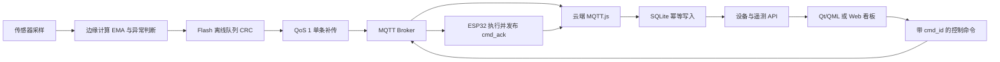

# 可靠物联网平台需求方案与实现方案

## 1. 需求边界

该版本在基础 MQTT 上传之上补齐端、边、云和客户端之间的可靠链路。

| 能力 | 需求 | 验收结果 |
| --- | --- | --- |
| 断线重连 | 断开后自动恢复，避免固定频率重连风暴 | 设备端和 Qt 均使用指数退避与随机抖动 |
| 流量控制 | 限制内存 outbox 和并发在途消息 | 16 KiB outbox、12 KiB补传高水位、单遥测 inflight |
| 数据缓存 | 网络中断和掉电后保留遥测 | 896 KiB 原始 Flash 分区、CRC 定长记录、双元数据日志 |
| 可靠补传 | Broker 确认前不得删除本地数据 | 遥测 QoS 1 PUBACK 后才从 Flash 出队 |
| 边缘计算 | 云端不可用时仍能本地处理数据 | EMA 平滑、上下限判断和传感器突变检测 |
| 云端业务 | 支持多设备、历史数据和命令状态 | SQLite 设备表、遥测表、命令状态机 |
| 幂等 | 重连重复投递不得形成重复历史 | `(device_id, boot_id, seq)` 唯一约束 |
| 设备交互 | 命令必须可追踪结果 | `cmd_id`、有效期、`cmd_ack`、ACKED/TIMEOUT/FAILED |
| 可观测性 | 能查看积压、丢弃、损坏、outbox 和边缘异常 | MQTT 状态/心跳及 `/api/status` 暴露指标 |

## 2. 端到端数据流

## 3. 设备端实现

### 3.1 Flash 队列

- 分区：`telemetry`，大小 896 KiB。
- 元数据：两个 4 KiB 扇区轮换追加，字段带 generation 和 CRC32。
- 数据：定长记录，包含原始值、边缘结果、`boot_id/seq`、采样时间和属性位。
- 环形回卷：只有目标扇区不再包含未确认记录时才擦除，避免误删队列数据。
- 队列策略：容量不足时保留旧记录、丢弃最新样本并累计 `dropped`。

### 3.2 MQTT 可靠性

- Topic 按 `device_id` 隔离。
- Keepalive 30 秒、持久会话、QoS 1 retained LWT。
- 手动指数退避重连，最大 30 秒并带抖动。
- 遥测只允许一条 inflight，PUBACK 后出队。
- 旧控制 JSON 兼容，新命令支持唯一 ID、有效期、去重和结果 ACK。

### 3.3 边缘计算

当前边缘模块使用常量规则完成：

- 温度、湿度和光照指数移动平均；
- 温湿度上下限和光照上限判断；
- 相对平滑值的快速突变检测；
- 异常位图随遥测持久化，断网期间计算不停止。

当前规则是固件默认值，尚未实现云端动态下发和 NVS 持久化；这是后续可扩展项，不应描述为已完成。

## 4. 云端实现

- MQTT.js 长连接订阅 `sensor/status/heartbeat/error/cmd_ack` 通配 Topic。
- MQTT 连接使用持久会话、QoS 1 和指数退避重连。
- `devices` 保存在线状态、固件、状态和最近报文。
- `telemetry` 保存原始值、边缘结果、补传标记，并以三元组唯一去重。
- `commands` 执行 `PENDING -> PUBLISHED -> ACKED/TIMEOUT/FAILED` 状态流转。
- 兼容旧 `/api/sensor/*`、`/api/iot/sensor` 和 `/api/cmd`，新增多设备接口。

## 5. 客户端实现

- Qt MQTT 持久会话和 QoS 1 订阅。
- 断线后指数退避，不再立即连续重连。
- 兼容新 `data` 嵌套遥测并订阅 `cmd_ack`。
- 控制命令生成 UUID、创建时间和 30 秒有效期。
- SQLite 安全增加 `device_id/boot_id/seq/replayed` 字段和唯一索引，不删除旧历史。

## 6. 部署与验收边界

1. 新增 `telemetry` 分区会改变分区表。旧设备第一次部署必须完整烧录分区表；只做 OTA 不会更新分区表。
2. A/B OTA 仍只更新应用分区，且现有健康确认时机、签名、Secure Boot、Flash Encryption 和 anti-rollback 仍属于生产加固项。
3. 固件构建、Node 后端接口测试和 Qt 编译已通过；仍需在真实 ESP32、真实 Broker 和断电/弱网场景做硬件验收。

建议硬件验收覆盖：连续断网 10 分钟后补传、Broker 重启、设备补传中再次掉电、队列临界容量、重复 QoS 1 投递、过期/重复命令、至少五轮 A/B OTA。
