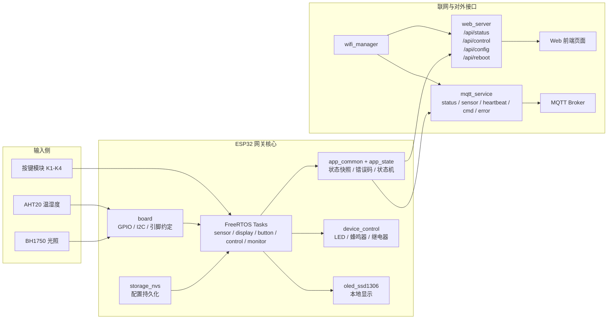
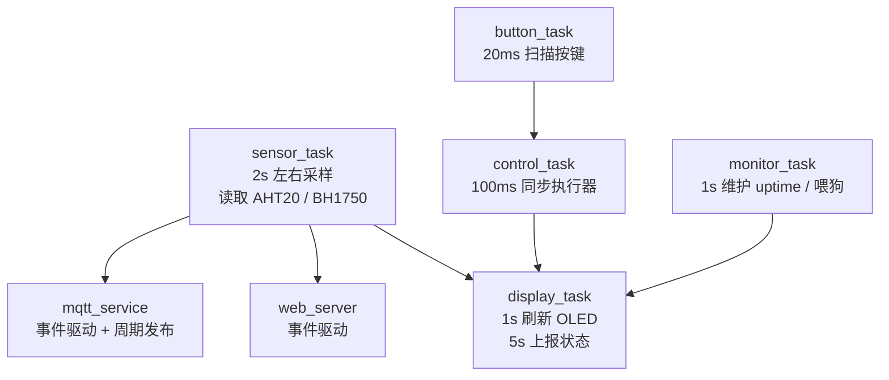

# 系统架构与任务划分

## 系统架构图

## 数据流说明

- `sensor_task` 周期读取 `AHT20`、`BH1750`，将数据写入全局状态快照。
- `button_task` 扫描 `K1~K4`，把用户输入转换成执行器控制意图。
- `control_task` 根据全局状态驱动 `LED`、蜂鸣器、继电器。
- `display_task` 周期刷新 `OLED`，同时承担状态日志与 MQTT 周期上报。
- `wifi_manager` 负责联网状态维护；联网后启动 `web_server` 与 `mqtt_service`。
- `web_server` 与 `mqtt_service` 都从统一状态快照读取数据，避免接口和页面各自维护状态。

## FreeRTOS 任务划分图

## 当前模块边界

- `board`：统一维护 GPIO、I2C 端口、设备地址等板级约定。
- `app_common`：维护设备全局状态、命令结构、错误码。
- `app_state`：管理 `INIT / WIFI_CONNECTING / MQTT_CONNECTING / ONLINE / RECOVERY / ERROR`。
- `device_control`：封装 `LED`、蜂鸣器、继电器输出。
- `sensor_aht20` / `sensor_bh1750`：封装传感器读取。
- `oled_ssd1306`：封装 I2C OLED 初始化、清屏与状态显示。
- `wifi_manager` / `web_server` / `mqtt_service`：负责联网、接口与消息通道。
- `storage_nvs`：保存 WiFi、MQTT、采样周期等配置。

## 当前状态

- 已打通：按键、LED、蜂鸣器、继电器、WiFi、Web API、前端页面、MQTT。
- 已接入：AHT20、BH1750、OLED 驱动。
- 待继续验收：AHT20 长时间稳定性、OLED 实机显示、OTA、异常恢复场景。
